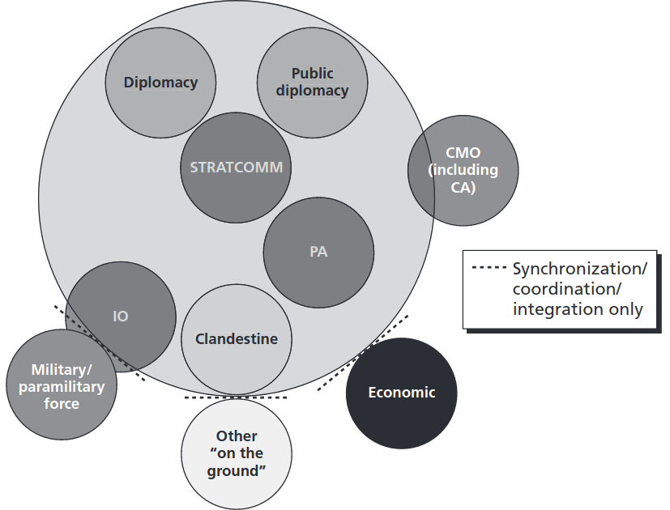

# Intro, background

Whereas influence operations (IOs) can be defined broadly as the organized attempts by actors to achieve specific effects (attitudes, behaviors, decisions) among target audiences [@larson2009foundations], disinformation campaigns often have a more narrow focus on the spread of false information through inauthentic actors with the intent to create political division and polarization [@wanless2019you; @santa2013improving; @larson2009foundations]. According to these definitions, IOs may be considered as more or less coextensive with strategic (planned) communication, and also as a superset of disinformation campaigns. 

Western governments are increasingly concerned about disinformation on social media and other forms of online influence operations. Sweden, largely due to its position outside NATO and geographical proximity to Russia, has been previously identified as a strategic target of IOs on Facebook. For example, foreign state-sponsored media outlets, such as Sputnik and RT, have been active spreading disinformation on Facebook since at least 2015 [@kragh2017russia]. And as artificial intelligence becomes increasingly sophisticated, the potential for more advanced methods of influence operations, such as deepfake videos, become a pressing threat for spreading false information from seemingly credible sources.

Since influence operations have the objective of using media and communication to cause a range of cognitive effects in audience members (attitudinal, behavioral, etc), a suitable methodological approach to study IOs is provided by the media effects and media psychology research fields [@valkenburg2016media; @dill2013oxford]. According to current media psychological theory, effects of online messages on audiences are mainly dependent on three factors: 1) the characteristics of the media message, 2) the cognitive and psychological makeup of the individuals receiving the message, and 3) the environment and context of internet use [@dill2013oxford; @valkenburg2004children].

By using the full range of digital communication technology (e.g. social media, hyperpartisan news websites, disinformation campaigns, online conspiracy videos), online influence operations can potentially gain substantial reach and engage a multitude of audiences. In order to help societies determine which operations are not legitimate / acceptable and thus should be countered, it is crucial that researchers try to understand the effects of IOs on individual as well as social levels. This subproject measures, evaluates, and offers solutions to counter online disinformation in Sweden. It accomplishes these aims through a three-pronged approach comprising: descriptive (Study 1), experimental (Studies 2 and 3), and prescriptive (Study 4) components.  

The descriptive phase seeks to diagnose the locations, extent, and strategies of IOs in Sweden (Study 1). Although research is just starting to be conducted on IOs, it is primarily concentrated in the United States. Due to America's unique demography and commercialized media system, the IOs evidenced there may not be similar to those conducted in Sweden. Thus, this sub-project's first research question is:  
 
- RQ1: To what extent are online influence operations conducted in Sweden, and how are they constructed?  

In the experimental phase, we seek to evaluate the effects of the disinformation strategies identified, and assess their potential for exacerbating ideological and affective polarization in Sweden. Here, we focus on individual level responses to disinformation, in terms of their effects on political opinions (Study 2) as well as how the interaction between technological and social mechanisms contribute to IOs deceiving citizens (Study 3). Therefore, we ask  

- RQ2: What effect does disinformation in Sweden have on a) ideological and b) affective polarization?  

- RQ3: How does the technological design of social media platforms contribute to the 	perceived authenticity of IOs?  

In the prescriptive phase, we build on the findings of these studies to offer proposed solutions for counteracting any negative effects we observe (Study 4). We do so with an eye to regulatory solutions, in terms of how such counter-active measure could be integrated within existing legal structures at the national and European Level.  

- RQ4: How can online disinformation be countered, and how can these counter-measures be feasibly integrated within existing regulatory frameworks?  

How are online influence operations (social media, hyperpartisan online news, disinfo websites, conspiracy videos, antivax) constructed, and what polarizing effects do they have on users?

online influence operations (IOs) can be modelled on the example of digital marketing campaigns, but with the difference that political interests are the ultimate goal rather than commercial.

the research on online IOs have developed sophisticated methods for analyzing online content and social networks. however research on media effects on target audiences remains understudied

research on effective countermeasures to online influence operations is also scarce.. to some extent because media effects are difficult to study (time, confounding factors, individual differences)

Media and communication psychology framework: media effects, personality traits, content features. 

- finding ways to measure effects of IOs in target audiences, media effects, media psychology
- measure polarization effects in individuals, psychology, physiology... however also effects on social level!!
- proof of activity is not the same as evidence of effects
- understanding audience effects is prerequisite to deciding how, what to be countered, foster calm among audiences 
- IOs, disinfo are highly networked, but research and countermeasures are not

## Polarization on individual level

Physiological correlates of affective polarization. Emotional image stimuli (<http://wang.ist.psu.edu/emotion/kim2017.htm>), combine with text to generate political advert stimuli. Do individuals with certain personality traits (high neuroticism, emotionality) have a higher susceptibility to polarization, higher risks of negative effects?

## Polarization on social level

Role of ethnicity in spread of disinfo, online influence operations

## Ethics and legal

Approval from ethical review board necessary for processing facial images in machine learning applications (e.g. deepfake generation), and when eleciting cognitive effects (e.g. memory effects). Manipulation of elections, ICCPR article 27-31

platforms provide data for vetting researchers?

algoritmer, en ko-ordinator myndighet står för vetting inom varje land (post- och telestyrelsen)

hur kan detta samarbete se ut mellan platform och universitet?

## Research technology

AIML in swedish language context, web portal with language models, collaboration with lund humanities lab

Moderation robots

communication

# Litterature review

Concepts, theories: Differential, conditional media effects (Valkenburg). Connecting online content features and user behavioral/cognitive/emotional effects. Communication effects (lack of). Web interfaces. Profile source cue verification. "Previous research, research gaps"

# Methods, Empirical studies

External collaborations: Partnership for Countering Influence Operations, Carnegie Endowment for International Peace, FB, Tobii, EUvsDisinfo? HUMLAB. Collaboration with psy.lu.se (Axel Ekström, Mikael Johansson)

## Study 1

### Aims and purpose  

Timeline. RQ, hypotheses, methods. Web scraping and automated content analysis (AIML). Social network analysis to identify inauthentic content, activity. Port methods for computational content analysis to Swedish language context. Comparative swedish-english component. Use GPT-3 approach to generate text messages, use as stimuli to study effects on human users.

### Existing research and hypotheses 

### Design and data 

### Contributions and significance

## Study 2

### Aims and purpose  

### Existing research and hypotheses 

### Design and data 

### Contributions and significance

Timeline. RQ, hypotheses, methods. Psychological and physiological experiments, physiological correlates of affective polarization, pupil dilation, GSR, EEG, fMRI etc. Web browsing behavior.

Memory of polarization exposure during distraction task. Benefit: only one experiment session.

## Study 3

Timeline. RQ, hypotheses, methods. Moral machines. Road blockage, no time to brake. Choose casualties. Automatized counter-measures to disinformation campaigns.

## Study 4

Timeline. RQ, hypotheses, methods. Antivax movement, polarization around covid-19 vaccinations. Online influence operations. the climate, sustainability angle could easily fit into the disinfo campaign research area.. the core idea would be to survey participants issue involvement (maybe as a pretest) and present normal vs deepfake videos of politicians that either support or go against their beliefs.. the hypothesis would be that deepfakes as such induce higher levels of fear (michael), higher levels of recall (axel), and lower levels of attitudes to politician (nils)

# Expected results, contribution

individual level

group level

ethics and legal

technology, methods

communication

collaborations with FB, twitter, Swedish Institute (countering disinfo campaigns)

- **RQ:** How are online influence operations (social media, websites, video etc) constructed, and what polarizing effects do they have on users?

- **Concepts, theories:** Differential, conditional media effects (Valkenburg). Connecting online content features and user behavioral/cognitive/emotional effects. Communication effects (lack of). Web interfaces. Profile source cue verification.

- **Methodology:** Web scraping and automated content analysis (AIML). Social network analysis to identify inauthentic content, activity. Psychological and physiological experiments, physiological correlates of affective polarization, pupil dilation, GSR, EEG, fMRI etc

- **Material, Data:** Twitter data, Facebook pages API data, Online news websites, video data, web interaction data (web measures, likes), physiological data. Anything relating to Swedish election 2022?

- Pi:s/coordin: check the mindmap!

- **External collaborations:** Partnership for Countering Influence Operations, Carnegie Endowment for International Peace, FB, Tobii, EUvsDisinfo? HUMLAB. The Swedish Civil Contingencies Agency (MSB)

- Individual vertical, continue to group level

- Personality traits, big five => divide into 1) content, 2) effects

- International comparisons?

# References

